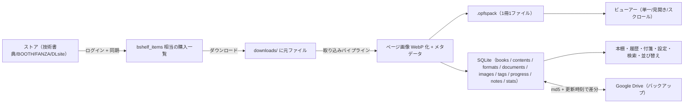

# 設計仕様書（AI 向け / 実装リファレンス）

**読み手は AI**。このアプリ（thundoku-shelf-app = デスクトップ版 Thundoku Shelf）を**別の言語・別のスタックで再実装できる**レベルまで、数値・定数・アルゴリズム・ID 規約・制約を列挙する。
本来の目的は **元になった Web 版（thundoku-web）へ、デスクトップ版で入った改修を戻す**ためのリファレンス。

## 0. 使い方（AI へ）

1. まず本ファイル（索引）を読む。全体像・用語・移植観点はここに集約してある。
2. 作業対象に応じて、下表の章を**必要な分だけ**読む（1 章ずつ独立して読めるように書いてある）。
3. **情報の優先順位は「コード > 本書 > `docs/features.md`」**。矛盾を見つけたらコードを正とし、本書のドリフトとして扱う。
4. 各事実には `crates/app/src/views/bookshelf.rs:1234` 形式のアンカーを付けてある。実装時はアンカーで一次情報を確認する。
5. 断定できない事項は各章末尾の「不明点 / 推測」に分離してある。**推測を事実として扱わない**。

| 章 | ファイル | 内容 | 分量 |
|---|---|---|---|
| 01 | `docs/spec/01-architecture.md` | クレート構成 / 起動シーケンス / 実行モデル（スレッド・非同期）/ データ配置 / 依存と選定理由 | 10KB |
| 02 | `docs/spec/02-data-model.md` | **DB スキーマ全量（CREATE TABLE 全文）** / マイグレーション方式 / ID 規約 / インデックス / 制約 | 47KB |
| 03 | `docs/spec/03-import-and-pack.md` | 取り込みパイプライン全段 / 判定・分岐・閾値 / `.opfspack` バイナリ構造 / 画像エンコード設定 / エラー型 | 52KB |
| 04 | `docs/spec/04-ui.md` | 全画面のレイアウト実寸（px）/ 表示モード / 操作とキーボード / アクション一覧 / UI 状態の復元 / 通知・ダイアログ / アイコン / **付録: UI 定数一覧（実装値）** | 45KB |
| 05 | `docs/spec/05-viewer-and-domain.md` | ビューアー（ページ決定式・見開き・ズーム・キャッシュ）/ 読書状態 / 付箋 / タグ生成と順序 / 検索・絞り込み / 並び替え / 統計 | 94KB |
| 06 | `docs/spec/06-sync-auth-drive.md` | 認証情報の保存先と保護 / Google アカウント（OAuth・`owner_sub`・切替）/ Google Drive 双方向同期 | 32KB |
| 07 | `docs/spec/07-decisions.md` | **なぜそうなっているか**（設計判断・代替案・実測に基づく再発防止・既知の制約） | 9KB |
| 08 | `docs/spec/08-notifications-and-nonfunctional.md` | 通知（送出元一覧）/ 非機能（DB PRAGMA・並列度・メモリ上限・直列化・単一インスタンス）/ ログ / 不明点・推測 | 47KB |
| 09 | `docs/spec/09-stores.md` | 技術書典 / BOOTH / FANZA / DLsite の同期手順（番号付き）と対象データ | 172KB |
| 10 | `docs/spec/10-pack-keys.md` | **pack の鍵 v3（乱数ルート鍵 + ラップ）の仕様**（Rust 側は実装済み / Web 版は未対応）/ ラップ形式 / 解決順序 / Web 実装チェックリスト / テストベクタ | 17KB |

> 全章を連結すると 1MB 近くになる（AI のコンテキストに収まらない）。**必要な章だけ読む**前提で分割している。

## 1. このアプリは何か（30 秒サマリ）

- オンラインストアで**購入した同人誌・技術書（PDF / 画像 ZIP / EPUB、非DRM のみ）**を、デスクトップで閲覧するアプリ。
- 本棚（カード / リスト）、ビューアー、閲覧履歴、付箋、チェックリスト、設定、説明の各画面を持つ。
- データは**すべて端末ローカル**（SQLite + `.opfspack` ファイル）。Google Drive へ任意でバックアップする。
- 対応ストアは **技術書典 / BOOTH / FANZA / DLsite**（ストアごとにログインと同期の実装を持つ）。
- デスクトップ版独自の改修が多く入っている（下の「移植観点」）。**Web 版へ戻す対象はここ**。

### 1.1 データの流れ（概観）

## 2. 用語集（実装上の意味）

| 用語 | 意味 | 実装上の注意 |
|---|---|---|
| **book** | 「購入した 1 冊」。`books` テーブル 1 行 = 1 冊 = `packs/{book_id}.opfspack` 1 ファイル | id は `identity.pack_id`（既存流用）または UUIDv4 |
| **shelf item** | ストア側の本棚エントリ（同期で得る購入情報）。ローカル本と `database_id` で突き合わせる | 未ダウンロードの本は shelf item だけ存在する |
| **content** | 1 冊の中の「作品」。ZIP に複数の本が入っている場合に複数になる | `content_id`（空文字 = 単一コンテンツ / 旧データ） |
| **rendition / format** | 同じ content の形式違い（PDF 版 / 画像版 など） | `format_id`。ビューアーで切替できる |
| **document** | 実際にページ画像を持つ単位（PDF 1 つ、画像 1 枚など） | `document_id`。`document_images` がページ画像 |
| **page** | ページ番号。**DB・表示は 1-indexed**、ビューアー内部は 0-indexed | 変換点を必ず確認する |
| **spread** | 見開き表示。左右の判定は「右綴じ / 左綴じ」設定に依存 | `spread_side`（left / right）を見開きの復元に使う |
| **付箋（note）** | ページ単位のメモ。1 ページ 1 件 | `page_notes`。`is_active` = 付箋の ON/OFF（OFF でもメモは残す） |
| **pack（.opfspack）** | 自前の書籍ファイル形式 | バイナリ仕様は 03 章 |
| **owner_sub** | Google アカウントの識別子。データに属性付けして切替に耐える | 03/06 章 |
| **読書状態** | 未読 / 読んでいる途中 / 読了 の 3 値 | 判定は 1 箇所（`ReadingState::from_progress`）に集約 |
| **閲覧統計** | 閲覧回数 / 累計閲覧時間 / 最終閲覧 | `view_history`（セッション）と `page_views`（ページ単位） |

## 3. 移植観点（Web 版へ戻すときのチェックリスト）

デスクトップ版で入った改修のうち、**Web 版に存在しない可能性が高い**もの。戻す際は 07 章の「なぜ」も併せて読むこと。

### 3.1 機能（UI/UX）

- [ ] **並び替え**（7 項目 × 昇順降順: 購入日 / 発売日 / タイトル / 最終閲覧日 / 閲覧回数 / 閲覧時間 / サイズ）
  - 日付はサイトごとの形式差（RFC3339 / `YYYY/MM/DD` / `YYYY年MM月DD日`）を**正規化して比較**
  - **データが無い項目はメニューに出さない**（発売日 = DLsite のみ、サイズ = ローカルのみ）
  - 値なしは方向に関係なく末尾、同順位はタイトル昇順
- [ ] **本棚の表示形式の保存**（`bookshelf.view_mode` = `card` / `list`。初期値は `card` で、次に開いたときに復元）
- [ ] **通知**（Info / Success / Error の 3 種・自動消滅）— 下部の 1 行表示は廃止し、**表示領域を本に充てる**
- [ ] **付箋**（ページ単位のメモ・付箋画面・ページ画像つき一覧・キーワード検索・✎ 行内編集・Enter で保存）
- [ ] **付箋一覧の 6 列**（表紙 / 情報 / タグ / 付箋ページ / メモ / 本を見る。表紙と付箋ページの画像は共有 LRU 64 件）
- [ ] **閲覧履歴**（1 日 1 本に集約・日付バー・期間/サイトフィルタ・カード/リスト・キーボード操作）
- [ ] **読書状態の 3 値統一**（未読 / 読んでいる途中 / 読了）と全画面での一貫表示
- [ ] **綴じ方向の本ごと保持**（既定はサイト別 `viewer.page_turn.{site}`、ビューアで変えた本だけ `books.page_turn` に保存）
- [ ] **ホイール 1 ノッチ送り**（通常ホイールは 1 ノッチ = 1 ページ。見開きでも 1 ページずつ。`Ctrl` + ホイールはズーム、Scroll とページ一覧などのパネル上ではページ送りしない）
  - 細かいデルタ（トラックパッド）は 1 ノッチぶん = 3 行まで累積してから 1 回だけ送る（1 イベントで何ページもめくらない）
- [ ] **ホイール方向の設定**（`viewer.wheel_direction` = `down-to-next`（既定）/ `up-to-next`。サイトに依らない共通設定で、未設定・未知の値は既定に倒す）
- [ ] **検索**（メモ / タイトル / サークル / 著者・1 文字ごとに反映・ヒット件数・絞り込み中表示と ESC 解除）
- [ ] **タグの優先表示**（選択中 → お気に入り → 集計数降順 → 名前順）と**幅に応じた折りたたみ**
- [ ] **関連書籍ショートカット**（同一サークル → 同一作者、最大 5 件。未DL は確認して取り込み、完了後に開く）
- [ ] **未ダウンロード本の確認ダイアログ**（「未ダウンロードです。ダウンロードしますか？」→ はい / いいえ）
- [ ] **ダウンロード中止**（コンテキストメニューの「ダウンロード中止」または `Backspace`。確認ダイアログの後、途中まで取得した内容は破棄する）
- [ ] **ログイン連動チェックリスト**（技術書典にログインしているときだけサイドバーの行とメニュー項目が使える。定期取得は未ログインならスキップし、同期・お気に入り取り込みはログイン導線を開く）

### 3.2 データ・ロジック

- [ ] **閲覧統計**（`view_history` のセッション + `page_views` のページ単位）と**1 クエリ集計**（`view_stats`）
- [ ] **付箋の ON/OFF とメモの分離**（`is_active`）＋ **見開き左右の復元**（`spread_side`）
- [ ] **コンテンツ / レンディションの分離**（同一作品の PDF 版・画像版の切替）
- [ ] **タグ自動生成**（形態素解析 + 外部タグ照合。**技術書典の同期時のみ**）
- [ ] **複数 Google アカウントの切替**（データを消さずに属性付けを変える）

### 3.3 非機能（Web 版では形が変わる点）

- [ ] **メモリ上限の設計**: スクロールのバイト予算 / サムネイル LRU / 自動ダウンロードの同時数
- [ ] **スレッド安全性**: PDF レンダラの直列化（Web 版でサーバ側レンダリングするなら別の解になる）
- [ ] **リーク防止**: 長時間生きた listener / タスクが**強い参照を持たない**（弱参照）
- [ ] **ストア同期の差分判定**: デスクトップ版は全件 UPSERT（Drive のみ md5 差分）— Web 版の都合に合わせて再検討

## 4. ドキュメントと実装のズレ（現状）

2026-09-14 に、仕様書作成時の調査で見つかった不整合のうち **7 件を修正**した（並び替えの永続化 /
タグ絞り込みがローカル本のみ / 見開きの滞在時間が 2 倍 / 追い出し時に GPU を解放しない /
`view_history::touch` 未使用 / `scroll_position` 常に 0 / Drive のフォルダキー）。

2026-09-20 の整備で、監査で見つかった仕様と実装のズレを `docs/spec` の各章と
`docs/features.md` / `docs/database.md` / `docs/import-patterns.md` / ルート `README.md` へ
反映した（バージョン表記、設定キーの一覧と `books.page_turn`、Settings の読み込み（画面に
入ったときの `reload` と描画中の DB 読みなし）、サイドバーのロゴと未読バッジ、付箋の 6 列と
共有 LRU、ホイール 1 ノッチ送りと方向設定、表紙キャッシュの 448px、Scroll の 384 MiB 予算、
通知の既定 5 秒など）。

残っているもの:

| 箇所 | 内容 |
|---|---|
| 実装（既知の制約） | Drive の保存先フォルダはアカウント別ではない（単一キー。`docs/account-switch.md` に明記済み） |
| セキュリティ（解消済み） | **F02**: **機密列**（`document_text.text_content`・`token_analysis` の 4 列・`page_notes.memo`）を AES-256-GCM（鍵は keyring の DB 鍵、AAD にテーブル/行キー/列名）で暗号化し、起動時に一度だけ既存の平文行を移行する（移行後は WAL も切り詰める）。**残る限界**: DB 全体（書誌・進捗・履歴）と `document_images.extracted_text` の旧平文、**DB ファイル内の未使用ページ**は平文のまま（VACUUM はしない。`docs/spec/07-decisions.md` §6） |
| 実装（対応中） | **大きな pack を RAM に載せない**: 閲覧（`PackFileReader`）・Drive からの取得（`download_to_file` でストリーム）・pack の組み立て（`build_to_file`）・ハッシュ計算・**Drive へのアップロード（`upload_multipart_from_file`）**は対応済み。取り込み中のページデータは `PackEntryStore` が保持し、**合計 64 MiB を超えたら一時ファイルへ逃がす**（pack の組み立ては 1 件ずつ供給 = ピークは「64 MiB + 1 ページ」）。**残り**: PDF は描画結果を `pages` に集めてから store へ渡すため全ページ分をメモリに持つ（`docs/spec/03-import-and-pack.md` に記載）。pack の上限は **10 GiB**（`MAX_TOTAL_SIZE` / `MAX_DOWNLOAD_BODY_BYTES`）。Drive へのアップロードは **resumable upload**（8 MiB ずつ + `308` で再開。2 GB ごとの分割は採らない。理由は `docs/spec/06-sync-auth-drive.md` §3.1）。**取り込み元ファイルは 2 GiB のまま**（`MAX_IMPORT_SOURCE_BYTES`。import はソース全体をメモリへ読む API なので、>2 GiB のソースは取り込み側の逐次化が要る）。2 GiB 超の本はダウンロード前に確認ダイアログを出す（`crates/core/src/store_size.rs`） |
| セキュリティ（解消済み） | **F03**: 未ログインの取り込みは**失敗**（`ImportError::LoginRequired`。平文 `.opfspack` を作らない — fail-closed）。UI（本棚のダウンロード・確認ダイアログ・再取得・お気に入りの自動ダウンロード）はダウンロードを**始める前**にログインを促す（`crates/core/src/import/mod.rs:248` の `pack_root_key_for_import` / `crates/app/src/pack_keys.rs:385` の `import_root_key` / `crates/app/src/views/bookshelf.rs:3822` の `require_import_login`）。README・`docs/features.md` に「**読むだけならログイン不要、取り込みには必要**」を明記 |
| セキュリティ（解消済み） | **F05**: 技術書典のセッションも共通 Vault（`tbf.session`。保存時刻つきの暗号文・**7 日**）へ移した。旧版の keyring 値（`user=techbookfest`・期限なし）は起動時に一度だけ移行して消し、**消せなければ印（`session-purge.pending`）を残して次の起動では復元しない**。ログアウトは①メモリ②端末の保存情報（vault / keyring。成否を待ち、失敗は成功として見せない）③サイト側④ログイン WebView の保存データ（`clear_all_browsing_data`）を区別して通知する。**残る限界**: WebView の消去は「呼べたか」までしか分からず（wry が完了を知らせない）、非 incognito のままなので起動中に WebView が保持した Cookie は 7 日の判定対象外（`docs/logout.md`） |
| セキュリティ（解消済み） | **F06**: 入力の総量・計算量に上限を入れた — 取り込み元は**読む前に** 2 GiB（`MAX_IMPORT_SOURCE_BYTES`）、外側 ZIP は**展開の前**に件数（`MAX_ENTRY_COUNT`）と宣言合計（2 GiB）、PDF は**描画の前**に総ページ数（`MAX_PDF_PAGES` = 9000）と累積出力量（2 GiB）、パスフレーズの `iterations` は **PBKDF2 の前**に 1000 万（`MAX_PASSPHRASE_ITERATIONS`）。**書き出し側でも読み出し側と同じ上限を検査**する（書けるが開けない pack を作らない）。2 GiB 超の本はダウンロード前に確認ダイアログ（`crates/core/src/store_size.rs`） |
| セキュリティ（設計判断待ち） | **F01 の本丸**: `sub` ラップを消す「パスフレーズ必須モード」（`docs/spec/10-pack-keys.md` §9）。現行の説明文は実装に合わせて訂正済み（同 §1.2） |
| 実装（Web 版のみ未対応） | pack の鍵は **v3（乱数ルート鍵 + `sub`／パスフレーズのラップ）へ移行済み**（`docs/spec/03-import-and-pack.md` §4.5 / `docs/spec/10-pack-keys.md`）。**v2 の pack は読めない**（`PackError::Version(2)`）ので、旧 pack は再取り込みが要る。残るのは **Web 版（`thundoku-shelf` モノレポの `packages/opfspack`）の対応**（§10 §7 のチェックリスト。Web が書く v2 pack はデスクトップでは開けない） |
| 運用（公開前の確認） | Google Cloud のクライアント種別・Web 版との secret 共用・同意画面の設定は**コードからは確認できない**。公開前に `docs/spec/06-sync-auth-drive.md` §2.5 の表で確認する |
| 運用（継続） | macOS 配布物は **Developer ID で署名し、Apple の公証（Notarization）を受ける**（v0.2.6 以降。`release.yml` の Import signing certificate / Package (macOS)。鍵は GitHub Secrets から一時キーチェーンへ入れ、`if: always()` で必ず削除する）。**Windows の Authenticode 署名は証明書が要るため未実施**。配布物のハッシュは `release.yml` が発行する |
| 運用（継続） | 依存の脆弱性は CI の `cargo audit` ジョブで確認する（2026-09-22 時点で**脆弱性 0 件**）。無視する例外は `.cargo/audit.toml` に理由と見直し時期つきで列挙（現在は `rsa` の 1 件のみ）。**脆弱性ではない警告 13 件**（未保守 11・unsound 2）は `docs/spec/07-decisions.md` §6.1 で「配布物に入るか」つきで分類済み。Actions はコミット SHA 固定、ビルド・テストは `--locked` |
| 運用（継続） | **公開はテスト・監査の合格に依存させる**（セキュリティ評価 F07）: `release.yml` の `checks` ジョブが `ci.yml` を再利用可能ワークフローとして呼び、`build` → `release` が `needs` で連なる。同じコミットでテストと `cargo audit` が通らなければ**ビルドも公開もしない**。Actions は全て完全なコミット SHA で固定（`upload-artifact` の例外も解消） |
| 運用（継続） | リリースごとに **SBOM（CycloneDX JSON）** を生成して配布物へ添付し、**zip と SBOM の両方に署名つきビルド来歴（attestation）** を付ける（`release.yml`。Sigstore の鍵レス署名。公開リポジトリは全プランで利用可）。検証は `gh attestation verify <zip> --repo MegaBlackLabel/thundoku-shelf-app`（SBOM は `--predicate-type https://cyclonedx.org/bom`）。SBOM は Rust の依存のみで、同梱する `pdfium.dll` 等のネイティブ部品は `release.yml` の SHA256 固定で追跡する |
| `docs/features.md` | 解消済み（検索対象を著者込みに更新。「書籍のバックアップ」ON/OFF は未実装の残件として明記し、実装は `drive.sync.enabled` に連動して pack を常時同期する） |
| コード内コメント | 解消済み（通知の 3 秒 → 5 秒、`pdf.rs` の 800px → 1000px） |
| 説明画面 | 解消済み（`docs/spec/04-ui.md` に現行文言） |

詳細と根拠は `docs/spec/07-decisions.md` の「既知の制約」を参照。
